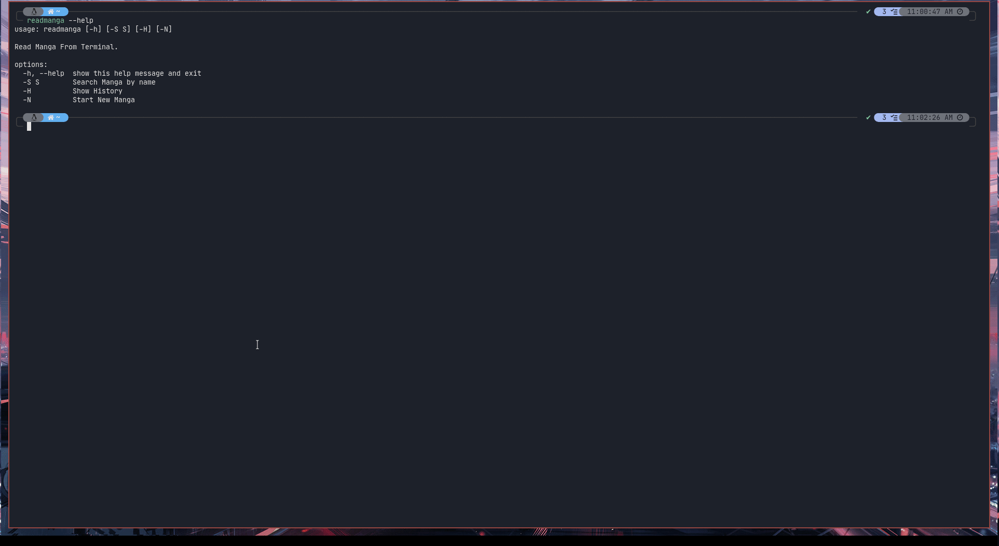

# Manga Reader

This is a terminal based app that allows you to keep track of manga and read it from terminal.
It works by allowing you to add your faviroute manga reading site and replace the chapter number
by a {}.





# Installation

```
git clone https://gitlab.com/Super-Yojan/mangareader.git
```

```
cd mangareader
```

```
sudo make
```

```
readmanga --help
```


